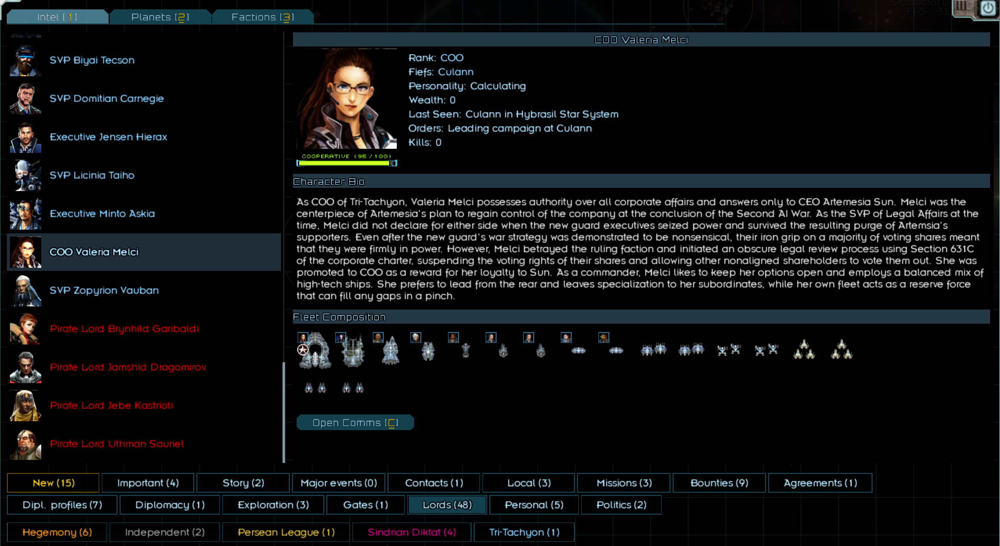
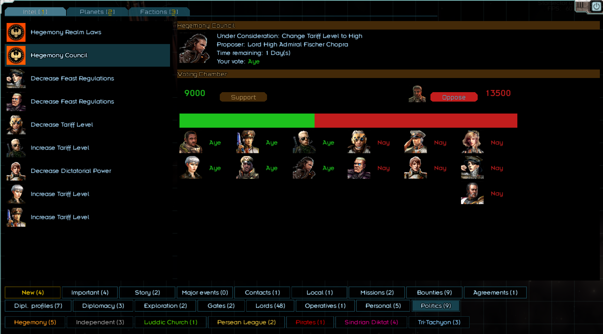

# Star Lords

Star Lords attempts to bring the world of [Starsector](https://fractalsoftworks.com/) of life with many character-centric features. Gone are the days of fighting alongside nameless faction fleets. The core mechanic is the addition of dozens of Lords to the game, each with their own personality, fleet composition, backstory, and agendas.

Lords will roam the map alongside the player raiding, trading, feasting, expanding, and more. When the Marshal raises the banners, the lords will muster to war in organized interplanetary campaigns of unprecedented scale.

A Lord's behavior is heavily dependent on their personality and interpersonal relations with other Lords. Inter-Lord relations are fully modeled, culminating in a brand new political system where Lords will politick, scheme, form alliances, and backstab while jockeying for wealth and influence within the realm.

Curry favor with Lords by completing their quests, fighting alongside them in battle, or supporting their political agenda. Form a core of close allies, and leverage their support to seize de-facto power in your faction's political system. Or convince them to join your own faction and support your claim to unite the sector.

Star Lords is heavily inspired by campaign mechanics of Mount and Blade. The goal is to eventually add all major campaign mechanics from Warband. This mod aims to have minimal side-effects on the game. There are no changes to in-battle gameplay, and no direct effects on campaign balance aside from the actions of the Lords themselves.

### Disclaimer
This mod is currently in early development. Expect plenty of bugs, crashes, questionable balancing, etc. Don't add this mod to existing saves and remember to save frequently. Please report any crash logs or balance feedback to the forums. Thank you for your cooperation.

### Full Feature List
* Adds __48 unique Lords__ spread among all the base major factions
* Adds fief system, where each Market is a fiefdom which can be owned by a Lord. 
* Custom __Economic system__ for Lords

  * Lords collect taxes from thier own fiefs and participate in business ventures in friendly markets. 
  * Income is used to expand their fleet, hire marines, and maintain existing ships.
* Custom fleet constructor for Lords, which allows each Lord to have their own __distinctive fleet composition__.
* Lords are __active on the map__, collecting income and waging war
  * Lord actions are heavily dependent on Lord's personality and relations with other Lords
  * Lord's officer corps slowly level ups from fighting in battles
* __Player-Lord Interactions__- If a lord trusts you sufficiently, they may follow the player's military orders, offer quests, participate in scheming, and share sensitive intel about their operations.
* __Feast system__- Take a reprieve from braving the sector and join the lords of the realms in a night of feasting and revelry.
* __Campaign system__- Campaigns may be started by faction's appointed marshal. Lead all the lords of the realm into epic clashes with hundreds of ships.
* __Defection system__- Lords that are dissatisfied with their faction may defect to another. Or you can speed along the process and persuade or bribe Lords to join your own faction as your suboordinates.
* __Political system__- The cornerstone of all lord relations, the new political system is where all lords of the realm gather to propose and vote on legislation. Appoint new marshals, squabble for newly conquered fiefs, conduct foreign policy, and more, as long as you can control the political situation.

### Major Planned Features
Most of these are inspired by Mount & Blade
* Continued Lord AI improvement and optimization
* Political marriage/courtship system for forming marriage alliances
* Expanded subterfuge system involving scheming with firendly lords to increase your status in the realm or discredit mutual rivals.
* Prisoner/ransom system for capturing Lords in battle
* "Freelancer" system for enlisting in a Lord's army and fighting as a common pilot
* Flesh out feast system, with feast tournaments as friendly competition with fellow Lords
* Better integration with Nexrellin invasions and base game crises
* Added custom questlines for certain lords, e.g. allowing AI-sympathizing lords to field [REDACTED] fleets.

### Installation
Download this repository as a zip and unzip in your Starsector mod folder

### Dependencies/Compatibility
This mod has no dependencies, though it's recommended to play with [Nexrellin](https://github.com/Histidine91/Nexerelin/tree/master) for planet capture mechanics. This mod should work with faction/ship/weapon mods which don't impact base campaign mechanics. Any kind of mod that only affects in-battle gameplay is also fine. All specific compatibilities are not yet tested.

### Credits
Starsector team for developing the game\
[Nexrellin](https://github.com/Histidine91/Nexerelin/tree/master) team's codebase for providing excellent references to many obscure parts of the Starsector API \
Interestio for Lord [portraits](https://fractalsoftworks.com/forum/index.php?topic=17066.0)
